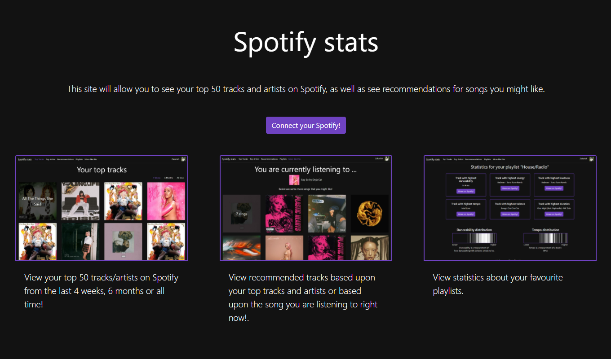
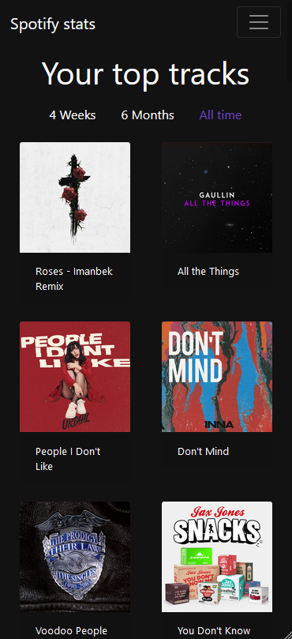

## Spotify stats

Spotify stats is a site that will show you your top tracks and artists as well as provide recomendations for new tracks and provide playlist statistics.

You can view your top artists and tracks that you have listened to on Spotify within 3 time periods, 4 weeks, 6 months and all time. You may also get recommended tracks based upon said top artists and tracks or alternatively by using the current track you are listening to on Spotify. You may finally view statistics about your owned/followed playlists.

## Set up
This project is built using laravel and so to install and use it you will need Composer installed on your server/PC.
* [Laravel](https://laravel.com/) 
* [Composer](https://getcomposer.org/) 

Move this project folder to your webserver/XAMPP web root (XAMPP/htdocs or /var/www) and simply cd/to/project/directory and run 

```
composer install
```

Once the dependencies are installed you will need to edit the .env file with your spotify developer account details.

## Screenshots

#### Index page


#### Top Tracks page


#### Top Artists page


#### Recommendations page


#### Statistics page


#### Track recommendations page


#### Mobile view
The mobile view has the content that is usually displayed ON the art, instead, displayed below it since hovering on mobile devices is difficult.

